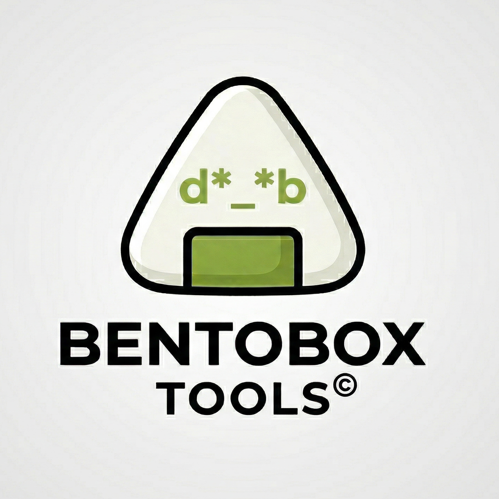
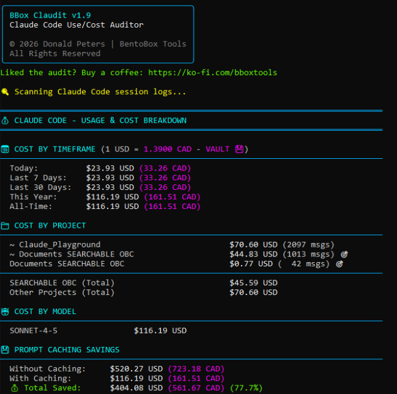

<p align="center">
  
</p>

# BBox Claudit

**Claude Code Use/Cost Auditor** by [BentoBox Tools](https://ko-fi.com/bboxtools)

A professional command-line auditor for Claude Code usage and costs. Tracks spending across sessions, converts totals to 100+ local currencies, and highlights prompt-cache savings — all with a clean BobAI-styled terminal UI.

---

## Features

- **Real-time cost breakdown** — daily, weekly, monthly, and yearly views
- **Project-level reporting** — see which projects consume the most credits
- **Prompt cache savings tracker** — shows exactly how much caching has saved you
- **100+ currency support** — live rates via [frankfurter.dev](https://www.frankfurter.dev); offline vault fallback
- **Zero config** — reads Claude Code session logs automatically; no API key required
- **BobAI aesthetic** — professional ANSI 256-color terminal interface

---

## Requirements

- Python 3.8+
- Claude Code CLI installed and actively used
- Internet connection for live exchange rates (optional; vault fallback included)

---

## Installation

```bash
# Copy the script to your PATH
cp claudit.py ~/bin/claudit.py        # Linux/macOS
# or
copy claudit.py %USERPROFILE%\bin\claudit.py  # Windows

# Make executable (Linux/macOS)
chmod +x ~/bin/claudit.py

# Windows: use the included launcher
copy claudit.cmd %USERPROFILE%\bin\claudit.cmd
```

---

## Usage

```bash
# Default: USD summary
claudit

# Convert to a local currency
claudit EUR
claudit GBP
claudit JPY
claudit CAD

# Any ISO 4217 code works
claudit INR
claudit AUD
claudit BRL
```

---

## Sample Output

<p align="center">
  
</p>

---

## Version History

See [CHANGELOG.txt](CHANGELOG.txt) for full release notes.

| Version | Highlights |
|---------|-----------|
| v1.9 | Snug-fit header box; dynamic currency conversion; 100+ ISO codes |
| v1.8 | Multi-timeframe reporting; project-level breakdown |
| v1.7 | Prompt cache savings tracker |

---

## Support

If BBox Claudit saves you money, consider buying a coffee:

**[ko-fi.com/bboxtools](https://ko-fi.com/bboxtools)**

---

## License

© 2026 Donald Peters | BentoBox Tools. All Rights Reserved.
